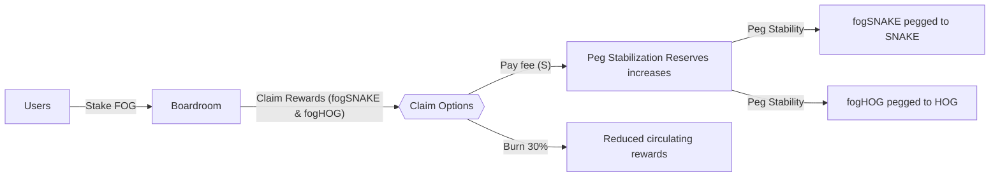
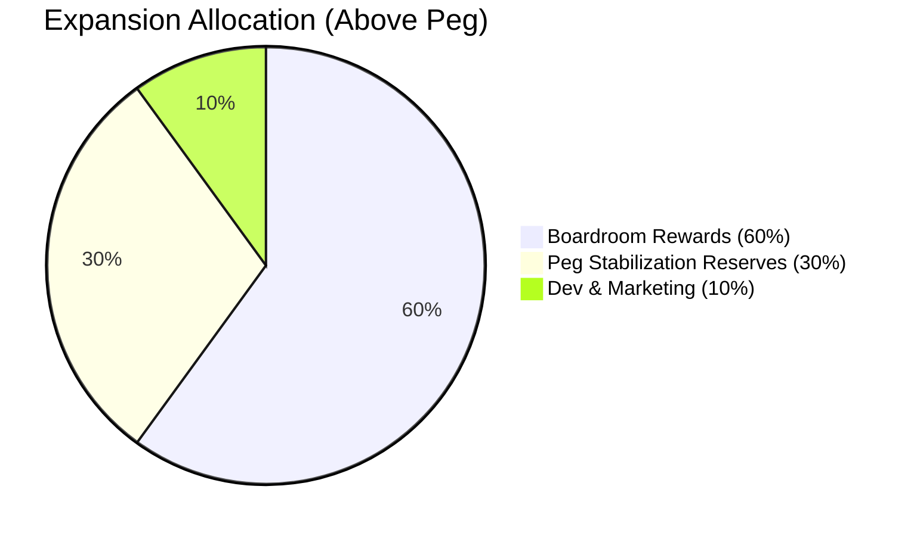
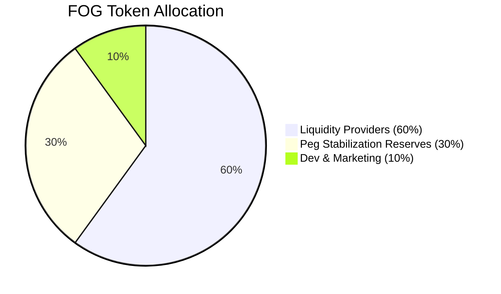

# 🐉 FingerOfGod: Smiting the Boundaries of DeFi on Sonic  
## 🚀 Official Launch Announcement & Updated Roadmap

We’re excited to announce key updates to the **FingerOfGod** protocol on **Sonic**, incorporating new timelines, tokenomics, and governance details. Below is the revised launch schedule and an overview of our enhanced mechanisms for peg stability and yield generation.

---

## 🔱 Inspired by Snake.finance & HandOfGod

**FingerOfGod** was born out of the incredible success and community-driven innovation of [Snake.finance](https://snake-finance.gitbook.io/snake-finance-docs) and [HandOfGod.app](https://hand-of-god.gitbook.io/hand-of-god). We’ve learned a great deal from their pioneering approaches to PSM fees, reward claim structures, and overall peg stability. Our mission is to **build upon their achievements**—not to compete against them—by bringing new innovations and synergy to the Sonic ecosystem. We hope **Snake** and **HOG** communities will find value in our project and see us as partners, working together to expand the DeFi frontier on Sonic.

---

## ⚔ Tokens at a Glance

- **fogSNAKE** 🐍  
  Pegged **1:1** with **SNAKE**. A rewards token in the FingerOfGod ecosystem, maintained by the Peg Stabilization Reserves.

- **fogHOG** 🐗  
  Pegged **1:1** with **HOG**. Similar to fogSNAKE, it serves as a rewards token supported through dynamic supply adjustments.

- **FOG** (Governance Token) 🏛️  
  Has a max supply of **10,000**. Staking FOG in the Boardroom grants governance rights and entitles holders to earn fogSNAKE and fogHOG as rewards.

---

## 📅 Revised Launch Timeline & Key Events

| Event                                     | Date & Time (UTC)        | Duration             |
|-------------------------------------------|---------------------------|----------------------|
| **Genesis Pools (fogSNAKE & fogHOG)**     | March 14, 2025, 12:00 PM | 7 days              |
| **FOG Farming Pool**                      | March 15, 2025, 12:00 PM | 2 years (tentative) |
| **Boardroom Launch (FOG Staking & Rewards)** | March 16, 2025, 12:00 PM | Ongoing             |

> **Note:** These dates are subject to final confirmation. Stay updated through official announcements in our community channels.

---

## 🎁 Genesis Pools (fogSNAKE & fogHOG)

During the Genesis phase, users can deposit **SNAKE, GSNAKE, HOG, GHOG**, and other supported Sonic assets (or specific LP tokens) to earn **fogSNAKE** and **fogHOG** over a 7-day window. This event provides a **fair initial distribution** of pegged tokens.

### Total Genesis Rewards
- **105,000 fogSNAKE** allocated (distributed at **15,000 per day**)
- **70,000 fogHOG** allocated (distributed at **10,000 per day**)

After the 7-day period, no additional **fogSNAKE** or **fogHOG** will be distributed through the Genesis Pools, ensuring early participants can get a head start while preventing long-term inflation.

---

## 🏺 FOG Farming Pool

Starting on **March 15, 2025 (12:00 PM UTC)**, the FOG Farming Pool runs for up to 2 years (tentative). Participants will pay a **25% PSM fee** on rewards. All fees flow into the **Peg Stabilization Reserves (PSR)** to maintain healthy pegs for fogSNAKE and fogHOG.

---

## 🏛️ Boardroom Launch (FOG Staking & Rewards)

The **Boardroom** opens on **March 16, 2025 (12:00 PM UTC)**. By staking **FOG**, users earn **fogSNAKE** and **fogHOG**. Below are new details on claim mechanics and tokenomics.

    
### Epoch Time
- **6 hours** per epoch.

### Mechanics
- **Staking & Unstaking:** Completely fee-free.  
- **Withdrawal Waiting Period:** 8 epochs (48 hours). Users can cancel anytime and restake immediately if desired.

### Reward Claim Structure
- **Reward Claim Lock:** 2 epochs (12 hours) after staking or claiming.  
- **Reward Expiry:** Rewards expire after 60 hours if unclaimed (automatically burned).

#### Claim Options
1. **Claim with Burn**  
   - Instantly receive **70%** of rewards.  
   - **30%** of rewards are burned.  

2. **Claim with PSM Fee**  
   - Receive **100%** of rewards immediately.  
   - Pay a **25% fee** in **S** (adjustable via FOG governance).  
   - Fee proceeds go to the **Peg Stabilization Reserves (PSR)**.

#### Loyalty Discounts (S Fee)
- **≥ 15 days staked**: 10% discount  
- **≥ 45 days staked**: 15% discount  
- **≥ 100 days staked**: 20% discount  
- **≥ 365 days staked**: 30% discount  

---

## 📊 Updated Tokenomics & Supply Mechanics

### Token Supply is Elastic

Instead of fixed burning, **FingerOfGod** now implements an **elastic supply** check twice a day (10 AM UTC and 10 PM UTC).  
- If **price < 1.0**, the total supply is reduced by up to **1%** to help bring the token price back to peg.

### Expansion Allocation (When Above Peg)

- **Boardroom Rewards:** 60%  
- **Peg Stabilization Reserves (PSR):** 30%  
- **Dev & Marketing:** 10%

This updated structure rewards active participants while bolstering our reserves for peg stability and ongoing development.

---

## 🧩 FOG Token (Governance Token)

**Max Supply:** 10,000 FOG

### FOG Allocation
- **60% Liquidity Providers (6,000 FOG)**  
  Distributed over 2 years, AI-governed emission rates.
- **30% Peg Stabilization Reserves (3,000 FOG)**  
  Linear vesting over 2 years.
- **10% Dev & Marketing (1,000 FOG)**  
  Linear vesting over 2 years.

Staking **FOG** in the Boardroom grants governance rights over protocol parameters (e.g., expansions, fees, or future peg strategies).

---

## 🌩️ Stability Mechanisms

1. **Adaptive Supply (Mint or Reduce):**  
   - **Price Above Peg:** Mint new fogSNAKE/fogHOG. A portion goes to Boardroom Rewards and PSR.  
   - **Price Below Peg:** Automatic supply reduction (up to 1%) during bi-daily checks.

2. **Peg Stabilization Reserves (PSR):**  
   - Collects fees from Boardroom claims and the FOG Farming Pool.  
   - Can buy back tokens at lower prices, directly supporting the peg.

3. **Collateral-Backed Redemption:**  
   - Users can burn fogHOG or fogSNAKE tokens to receive **S** directly from the PSR.  
   - This reduces circulating supply and stabilizes price when market demand weakens.

4. **Boardroom Dynamics:**  
   - By staking **FOG**, participants earn dual rewards (fogSNAKE & fogHOG).  
   - Claim options let users choose between partial burns or paying a PSM fee (all fees going to PSR).

---

## 🗺️ Path Forward

1. **Multi-Peg Integrations:** Explore adding new pegged tokens beyond SNAKE and HOG.  
2. **Cross-Chain Expansion:** Potential bridging of the FingerOfGod ecosystem to other networks.  
3. **Advanced Governance:** Continued rollout of proposals, voting enhancements, and AI-driven rate adjustments.  
4. **Community Engagement:** AMAs, tutorials, and user guides for new and existing participants.

---

## 🌐 Get Involved

- **Website:** [fingerofgod.app](https://fingerofgod.app)  
- **Genesis Pools:** Earn fogSNAKE/fogHOG starting March 14, 2025.  
- **FOG Farming Pool:** Begins March 15, 2025.  
- **Boardroom:** Launches March 16, 2025, for staking **FOG** and earning dual-token rewards.

Join us as we refine DeFi on Sonic—blending dynamic pegs, real-time supply adjustments, and robust governance to pioneer the next era of decentralized finance—*all while celebrating and building upon the achievements of Snake.finance and HandOfGod.* We look forward to growing together, not competing, and contributing to a healthier, more vibrant ecosystem for everyone.

---

**Disclaimer:** DeFi projects involve inherent risks. Users should always DYOR (do your own research) and invest responsibly.
